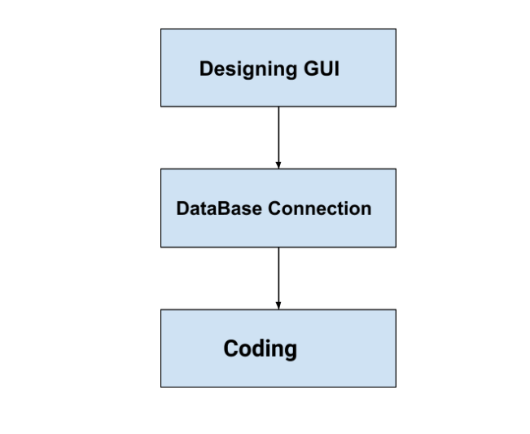

# CropGuide

In these modern times, with many environmental factors to be considered, it's challenging for the agricultural sector to make efficient decisions at the right time. So this application can help the farmers to make better decisions on the crops to be harvested based on several surveys and parameters.

## Technologies Used

1. Python
2. PyQt5
3. SQLite

## Workflow

## Outputs of GUI

