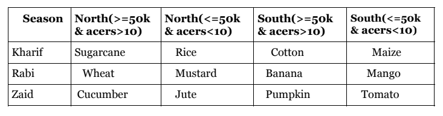
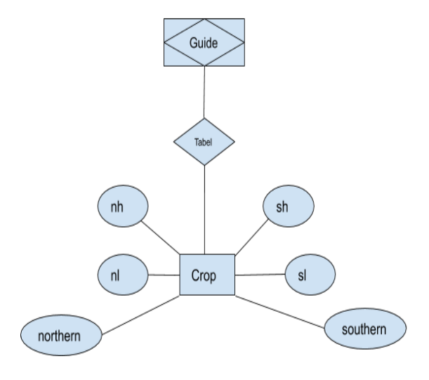

# Crop-Guide

In these modern times, with many environmental factors to be considered, it's challenging for the agricultural sector to make efficient decisions at the right time. So this application can help the farmers to make better decisions on the crops to be harvested based on several surveys and parameters.

## Technologies Used

1. Python
2. PyQt5
3. SQLite

## Workflow


## Outputs of GUI


## Table Structure



## SQL Tables


## Entity Relationship (ER) Diagram



## Steps to run the project

1. Install the modules in 'requirements.txt' by running

```bash
pip install -r requirements,txt
```

2. Install the 'Qt-Designer':
https://build-system.fman.io/qt-designer-download
3. To run this project unzip the folder named 'CropGuide_py'.
4. Then run the file named 'cropguide.py'.
5. To convert the '.ui' file to '.py' file use the command

In our case 

```bash
pyuic5 -x crop.ui -o crop_guide.py
```

In general,

```bash
pyuic5 -x filename -o new filename
```